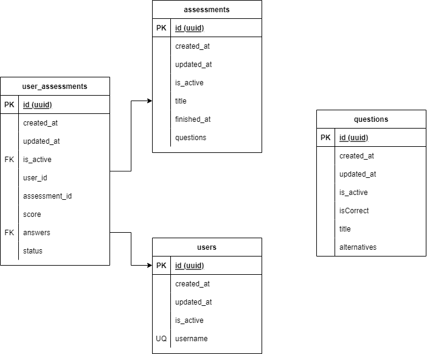

# GamaLab Squad Paredão - Sistema de Provas

<strong>Web app para gerenciamento de provas avaliativas.</strong>

<a id="indice"></a>
## Indice de conteúdo

<p align="center">
<a href="#anc1">Membros</a>&nbsp;&nbsp;&nbsp;|&nbsp;&nbsp;&nbsp;
<a href="#anc2">Convenções de desenvolvimento</a>&nbsp;&nbsp;&nbsp;|&nbsp;&nbsp;&nbsp;
<a href="#anc3">Git Flow</a>&nbsp;&nbsp;&nbsp;|&nbsp;&nbsp;&nbsp;
<a href="#anc4">Tecnologias</a>&nbsp;&nbsp;&nbsp;|&nbsp;&nbsp;&nbsp;
<a href="#anc5">Banco de dados</a>&nbsp;&nbsp;&nbsp;|&nbsp;&nbsp;&nbsp;
<a href="#anc6">Rodando o projeto</a>&nbsp;&nbsp;&nbsp;|&nbsp;&nbsp;&nbsp;
<a href="#anc7">Licença</a>

</p>

#

<a id="anc1"></a>

## Membros

- [Rafael Sampaio](https://github.com/sampaiorafael) - Tech Lead
- [Lucas Veiga](https://github.com/lucasveigaa) - Front end Developer
- [Júnior Dering](https://github.com/orloke) - Front end Developer
- [André Lima](https://github.com/andresdslima) - Front end Developer
- [Álvaro M Ferreira](https://github.com/alvaroaxsmith) - Back end Developer


<a id="anc2"></a>
## Convenções de desenvolvimento

- Mensagens de commit
  - [Conventional Commits](https://www.conventionalcommits.org/en/v1.0.0/)
- Nomeclatura de variaveis/métodos/funções...
  - Cammel case
    - Ex: const async getProductCountById()
- Nomeclatura de branches
  - Feature --> feat/01
  - Hotfix --> hotfix/01
- Nomeclatura de tabelas e colunas
  - Snake case
    - Ex: created_at


<a id="anc3"></a>

## Git Flow


<a id="anc4"></a>

## Tecnologias

### Geral

- [Node.js](https://nodejs.org/en/)
- [TypeScript](https://www.typescriptlang.org/)
- [Git](https://git-scm.com/)

### Infraestrutura
- [Vercel](https://vercel.com/)
- [Heroku](https://www.heroku.com/)

### Back-end
- [NestJS](https://nestjs.com/)
- [TypeORM](https://typeorm.io/#/)
- [PostgreSQL](https://www.postgresql.org/)
- [Docker Compose](https://docs.docker.com/compose/)
- [Swagger](https://swagger.io/)


### Front-end
- [React](https://pt-br.reactjs.org/)
- [Vite](https://vitejs.dev/)
- [Bootstrap](https://getbootstrap.com/)
- [Smash](https://smash.gama.academy/main/web/storybook/)
- [Styled Components](https://styled-components.com/)
- [Redux](https://redux.js.org/)

<div align = "right"><a href="#indice">⬆️ Voltar ao topo</a> </div>

<a id="anc5"></a>

## Banco de dados
### Diagrama de Entidade Relacionamento


<a id="anc6"></a>

## Como rodar o projeto localmente no back-end

Clone o projeto

```bash
$ git clone https://github.com/gamaacademy-labs/assesment-api.git
```

Entre no repositorio

```bash
$ cd assesment-api
```
Instale as dependências

```bash
$ npm install
```
Rode o docker-compose

```bash
$ docker-compose up -d
```
Rode as migrations

```bash
$ npm run setup:dev
```
Rode o projeto

```bash
$ npm run start:dev
```

Abra o navegador e acesse http://localhost:8080/docs

## Como rodar o projeto localmente no front-end

Clone o projeto

```bash
$ git clone https://github.com/gamaacademy-labs/assesment-web.git
```

Entre no repositorio

```bash
$ cd assesment-web
```
Instale as dependências

```bash
$ npm install
```
Rode o projeto

```bash
$ npm run dev
```

Abra o navegador e acesse http://localhost:5173/


<a id="anc7"></a>

## Licença

Esse projeto está sob a licença MIT. Veja o arquivo [LICENSE](https://github.com/gamaacademy-labs/assesment-api/blob/main/LICENSE) para mais detalhes.

<div align = "right"><a href="#indice">⬆️ Voltar ao topo</a> </div>

#